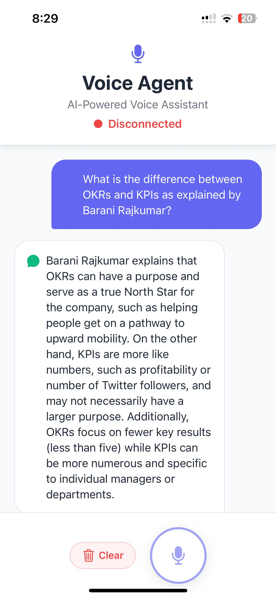
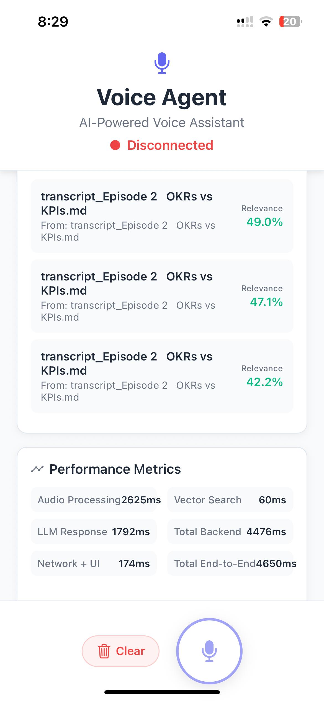
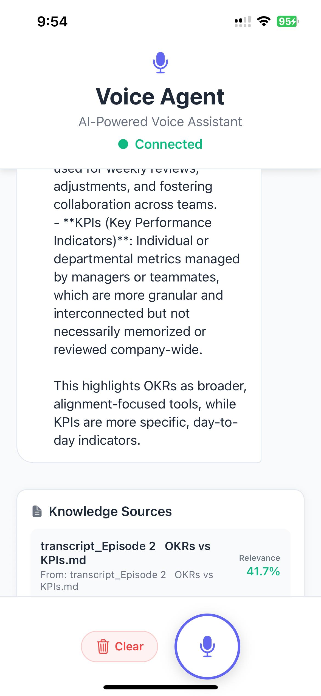
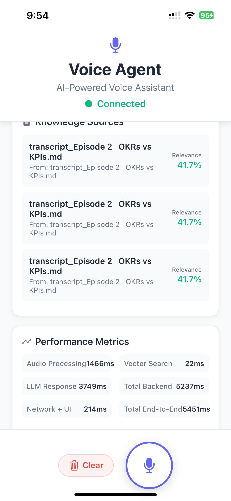

# AUDIO_RAG Prototype

This repository contains a simple prototype of a voice agent that demonstrates
Retrieval Augmented Generation (RAG) from audio input.

## Components

- `frontend/` – React Native application with a single page to record audio and
  display the transcription and response from the backend.
- `backend/` – FastAPI service that handles speech-to-text, vector search via
  FAISS, and LLM interaction.

## Setup

### Backend

```bash
cd backend
python3 -m venv venv
source venv/bin/activate
pip install -r requirements.txt
uvicorn main:app --reload
```

### Frontend

Requires Node.js and Expo CLI.

```bash
cd frontend
npm install
npm start
```

The mobile app expects the backend to run on `http://localhost:8000`.

## Sample Knowledge Base

Two markdown files in `backend/data/sample_kb/` are loaded into FAISS on
startup. Modify or add documents there to experiment with retrieval.

## Prototype Configurations

### Prototype-1 (Current Implementation)


**Architecture:**
- **Frontend**: React Native mobile app with audio recording
- **Backend**: FastAPI server with audio processing and RAG pipeline
- **Vector Database**: FAISS for document storage and similarity search
- **Audio Processing**: OpenAI Whisper for speech-to-text conversion
- **Language Model**: OpenAI GPT-3.5-turbo for response generation
- **Document Chunking**: Custom token-based chunker with tiktoken

**Key Configurations:**
- **Whisper Model**: `whisper.load_model("base")` with fp16=False
- **Vector Store**: FAISS IndexFlatIP with 384-dimensional embeddings
- **Embedding Model**: Sentence Transformers `all-MiniLM-L6-v2`
- **Chunk Size**: 512 tokens (configurable via `CHUNK_SIZE` env var)
- **Chunk Overlap**: 50 tokens (configurable via `CHUNK_OVERLAP` env var)
- **Search Results**: Top 3 most similar documents
- **Audio Format**: WAV, 16kHz, mono, 128kbps
- **Batch Processing**: 25 documents per batch during ingestion

**Performance Metrics:**
- **Audio Processing**: ~2.6s (Whisper transcription + conversion)
- **Vector Search**: ~60ms (FAISS similarity search)
- **LLM Response**: ~1.8s (OpenAI GPT-3.5-turbo)
- **Total Latency**: ~4.7s end-to-end

**Environment Variables:**
- `OPENAI_API_KEY`: OpenAI API key for LLM access
- `SKIP_INGESTION`: Set to "true" to skip document ingestion
- `CHUNK_SIZE`: Token count per chunk (default: 512)
- `CHUNK_OVERLAP`: Overlapping tokens between chunks (default: 50)

**Screenshots:**

<table>
  <tr>
    <td></td>
    <td></td>
  </tr>
  <tr>
    <td><em>GPT-3.5-turbo response example</em></td>
    <td><em>GPT-3.5-turbo interface demonstration</em></td>
  </tr>
</table>


### Prototype-2

*Prototype-2 uses Grok instead of GPT-3.5-turbo for response generation.*

**Key Differences from Prototype-1:**
- **Language Model**: Grok (instead of OpenAI GPT-3.5-turbo)
- **Other components remain the same**: FAISS vector store, Whisper transcription, React Native frontend

**Screenshots:**
<table>
  <tr>
    <td></td>
    <td></td>
    <td></td>
  </tr>
  <tr>
    <td><em>Grok response example</em></td>
    <td><em>Grok interface demonstration</em></td>
    <td><em>Grok additional functionality</em></td>
  </tr>
</table>


## Report

See [`report.md`](report.md) for a short comparison of latency, quality, and
cost considerations for different backend models.

See [`prototype-1-report.md`](prototype-1-report.md) for detailed configuration and performance analysis of the current implementation.
